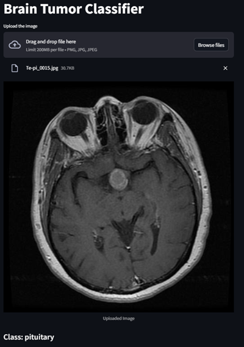

# Brain Tumor Classification using Hybrid Deep Learning Models

A powerful deep learning project that classifies brain MRI images into tumor and non-tumor categories using **Convolutional Neural Networks (CNNs)** and hybrid ML models.  
Built to support clinical insights and automate early tumor detection with **95% accuracy**.

> Developed by **Venkatesh P** as part of an academic research initiative under **RUSA – University of Madras**.

---

## Overview

This project focuses on classifying MRI brain images into four categories:
- **Glioma Tumor**
- **Meningioma Tumor**
- **Pituitary Tumor**
- **No Tumor**

It uses **TensorFlow CNN** for image feature extraction and **XGBoost / Random Forest** for enhanced prediction accuracy.  
The hybrid architecture combines the strengths of both deep learning and traditional machine learning to achieve better interpretability and generalization.

---

## Dataset

- **Source:** [Kaggle Dataset](https://www.kaggle.com/datasets/masoudnickparvar/brain-tumor-mri-dataset/data)
- **Total Images:** 7023  
- **Classes:** Glioma, Meningioma, Pituitary, No Tumor  
- **Image Size:** 224 × 224 pixels  
- **Format:** `.jpg`  

| Tumor Type | No. of Images | Example |
|-------------|----------------|----------|
| Glioma | 1321 |  |
| Meningioma | 1339 |  |
| Pituitary | 1457 |  |
| No Tumor | 1595 |  |

---

## Workflow

1. **Data Preprocessing**  
   - Image resizing, normalization, and augmentation (flip, rotate, color jitter)  
2. **Model Design**  
   - CNN (ResNet18-based) for feature extraction  
   - Features fed into ML classifiers (SVM, RF, XGBoost)  
3. **Training and Validation**  
   - 80/20 train-test split  
   - Adam optimizer and cross-entropy loss  
4. **Evaluation**  
   - Accuracy, Precision, Recall, F1-score, Confusion Matrix  

---

## Model Architecture
Input MRI → ResNet18 (Feature Extraction) → SVM / RandomForest / XGBoost → Predicted Tumor Class

**Key Highlights:**
- CNN extracts deep 512-D feature vectors  
- XGBoost achieved best accuracy (95%)  
- Feature importance visualized for interpretability  

---

## 🧪 Model Performance

| Model | Accuracy | Precision | Recall | F1-score |
|--------|-----------|------------|---------|-----------|
| CNN + XGBoost | **95%** | 0.95 | 0.95 | 0.95 |
| CNN + Random Forest | 94.6% | 0.93 | 0.94 | 0.93 |
| CNN + SVM | 93.2% | 0.92 | 0.91 | 0.91 |

---

## Tech Stack

- **Languages:** Python  
- **Deep Learning:** TensorFlow, PyTorch  
- **Machine Learning:** scikit-learn, XGBoost  
- **Visualization:** Matplotlib, Seaborn  
- **Deployment Tools:** Streamlit, Docker  
- **Version Control:** Git, DVC  

---
## Results & Visualization

- ** Confusion Matrix and ROC Curve
- ** t-SNE projection of CNN feature space
- ** Class Activation Maps (CAM) for visual interpretability

## Insights

- ** Hybrid CNN + ML architecture outperforms standalone CNN models
- ** XGBoost provides strong performance with lower computational cost
- ** Feature extraction helps reduce overfitting on limited datasets
- ** Highly suitable for medical image classification research

## Future Work

- ** Integrate Grad-CAM for tumor localization
- ** Deploy model on Streamlit + FastAPI
- ** Experiment with Vision Transformers (ViT) for performance gain
- ** Combine MRI + genetic data for multi-modal learning

## Author

Venkatesh P
Machine Learning Engineer | Bioinformatics Explorer | Data Science Enthusiast
